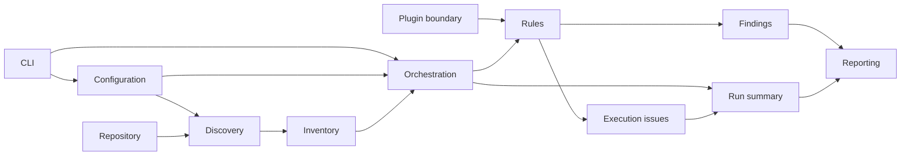

# System Design

## Runtime baseline

The MVP will use Python on CPython, as recorded in [ADR-001](../decisions/ADR-001-select-language-runtime.md). The initial minimum runtime is CPython 3.12; supported versions follow the policy in that ADR.

This establishes the runtime boundary only. Application framework, package/module structure, component boundaries, distribution method, plugin contract, and library selection remain separate decisions. Until those decisions are recorded, architecture work should preserve a deterministic local-CLI model that processes filesystem and Git-repository inputs and emits validator-backed evidence.

## Implementation implications

- Development tooling and packaging will use Python-native conventions, selected in subsequent work.
- Plugin and rule interfaces may use Python extension mechanisms, but their contract and isolation policy are not yet defined.
- Validation will cover the oldest and newest supported CPython versions once automated validation is introduced.

## Repository structure

[ADR-002](../decisions/ADR-002-define-repository-structure.md) establishes a `src/`-based repository structure with a single first-party Python package namespace. It separates application source, tests, documentation, examples, scripts, and ignored generated artifacts while leaving detailed component boundaries to ADR-003.

## Component model and data flow

[ADR-003](../decisions/ADR-003-define-core-component-boundaries.md) proposes the conceptual component model. Stable findings and run summaries separate audit results from CLI and report presentation, while the plugin boundary keeps external implementations outside the core dependency graph.

This is a conceptual data-flow diagram, not a module or API design. Detailed component contracts and implementation mechanisms remain deferred.
