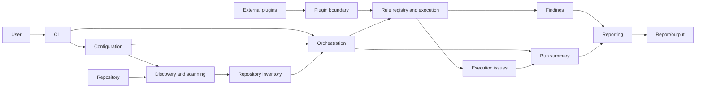

# ADR-003: Define Core Component Boundaries

- **Status:** Proposed
- **Date:** 2026-08-07
- **Decision:** Organize the MVP around outer interaction/adaptation concerns, deterministic audit capabilities, and stable domain-result contracts.

## Context

ADR-001 selected CPython 3.12+, and ADR-002 established the `src/generic_audit_tool/` namespace and future placement rules. The MVP needs a component model that supports local repository audits, deterministic results, report formats, and future plugins without tying domain results to a CLI, filesystem, renderer, or external implementation.

## Decision drivers

- Preserve validator-backed, deterministic evidence as the basis for audit outcomes.
- Keep user interaction, repository access, rule execution, and report presentation separable.
- Provide stable conceptual results that can support more than one report format.
- Allow a future plugin boundary without selecting a loading or distribution mechanism.
- Define enough direction for implementation planning without prescribing APIs or modules.

## Component model

The following are conceptual boundaries. They do not prescribe classes, interfaces, method signatures, or a one-to-one Python-module mapping.

| Component | Responsibility | Conceptual inputs | Conceptual outputs | Failure behavior | Permitted dependencies | Must not depend on |
| --- | --- | --- | --- | --- | --- | --- |
| CLI | Translate a user invocation into an audit request and present the completed outcome. | Arguments, environment, user-selected repository and output options. | Invocation request and user-facing outcome/exit status. | Reports invocation or configuration errors clearly; does not fabricate audit results. | Configuration, orchestration, and stable outcome contracts. | A specific CLI framework, filesystem scanning details, rule internals, or renderer internals. |
| Configuration | Interpret and validate audit settings and defaults. | User input, supported configuration sources, and defaults. | Validated audit options or configuration issues. | Stops dependent work when required settings are invalid; preserves actionable validation issues. | Stable domain concepts needed to express options. | CLI framework, discovery implementation, rule implementation, report format, or plugin implementation. |
| Discovery and scanning | Produce a deterministic inventory of eligible repository content and scanning issues. | Repository reference and validated scan options. | Repository inventory and discovery issues. | Records inaccessible, excluded, or unsupported content as execution issues according to policy. | Configuration and stable inventory/result concepts. | CLI presentation, reporting, rule implementation, and external plugins. |
| Orchestration | Coordinate one audit run, ordering and combining established capabilities into a run outcome. | Validated options, repository inventory, available rule capabilities, and boundary-provided contributions. | Run summary, findings, and execution issues. | Produces a complete, partial, or failed run outcome without losing collected evidence. | Configuration, discovery, rule execution, plugin boundary contracts, and domain-result contracts. | CLI presentation, report rendering, external plugin implementation, and persistence technology. |
| Rules | Register and execute applicable audit rules against supplied audit context. | Rule capability metadata, repository inventory, and relevant validated options. | Findings and rule-execution issues. | Isolates a rule failure as an execution issue where policy permits; never replaces evidence with a report-format-specific result. | Stable inventory, finding, and execution-issue concepts. | CLI, report formats/renderers, orchestration internals, and external plugin implementations. |
| Findings | Represent stable, validator-backed audit observations independent of presentation. | Evidence and rule-evaluation outcomes. | Findings with identity, scope, classification, evidence references, explanation, and remediation context. | Rejects or records invalid result construction as an execution issue; does not encode display behavior. | Other domain-result concepts only. | Filesystem access, CLI, report rendering, plugin loading, and test fixtures. |
| Reporting | Turn stable audit results into requested human- or machine-consumable representations. | Findings, run summary, and output presentation options. | Rendered output or output-artifact references, plus output issues. | Reports rendering or destination failures without changing the underlying findings or run summary. | Stable finding and run-summary contracts plus presentation options. | Discovery, rule execution, orchestration internals, or a specific plugin implementation. |
| Plugin boundary | Define the core-facing contribution boundary for future extensions. | Contribution metadata and stable core contracts. | Compatible capability contributions or boundary issues. | Rejects incompatible or invalid contributions without making external implementations a core dependency. | Stable rule/domain contracts. | A plugin discovery/loading technology, distribution mechanism, or plugin-specific internal behavior. |

## High-level execution and data flow

The diagram expresses data flow, not an API call graph. In particular, external plugins flow through the plugin boundary as contributions; the core does not import or depend on plugin implementations.

## Stable conceptual contracts

### Findings

A finding is a presentation-independent, validator-backed observation. It conceptually carries:

- a stable rule or origin identity and affected repository scope;
- classification such as severity or outcome category;
- evidence references sufficient to explain what was verified;
- a human-meaningful explanation and remediation context; and
- enough provenance to relate it to an audit run.

Findings are domain results. They do not contain renderer-specific markup, CLI exit behavior, filesystem handles, or plugin implementation objects.

### Run summaries and execution issues

A run summary is the stable account of one audit attempt. It conceptually carries run identity, the evaluated scope, overall completion state, aggregate finding information, and a collection of execution issues. Completion state distinguishes successful completion, partial completion with usable results, and failure without a usable result.

An execution issue represents a problem encountered while configuring, discovering, executing rules, accepting a contribution, or producing output. It has a source/stage, severity or impact, explanatory context, and whether the run could continue. Execution issues are not findings: they explain limitations or failures of the audit process rather than a validator-backed observation about the repository.

Reporting consumes only the stable finding and run-summary contracts. It may represent execution issues, but it must not reinterpret rule behavior or depend on rule/orchestration internals.

## Determinism and validation

- Configuration owns validation of supplied audit options before dependent work begins.
- Discovery owns deterministic selection and ordering of repository content within the accepted scan policy.
- Rules own validator-backed evaluation and must emit stable findings or execution issues from supplied context.
- Orchestration owns deterministic composition of inventory, rule outcomes, and execution issues into a run summary.
- Reporting preserves domain-result facts and owns only representation/output failures.

The exact ordering algorithms, validation libraries, and concurrency strategy are deferred.

## Dependency direction

The dependency graph is acyclic at the conceptual level:

1. Stable domain-result contracts sit at the center and do not depend on outer concerns.
2. Discovery and rules use stable domain concepts to produce domain results.
3. Orchestration depends inward on configuration, discovery, rules, and the plugin boundary contracts to compose a run outcome.
4. CLI and reporting are outer consumers of stable outcomes; neither is required by rule execution.
5. External plugin implementations remain outside the core dependency graph and interact only through the future plugin boundary.

## Consequences

- Later work can add a CLI, configuration source, rule packs, and report formats without changing the meaning of findings or run summaries.
- The proposed boundaries make partial results and execution limitations visible rather than hiding them in a renderer or exit code.
- ADR-002 placement paths remain valid, but this ADR does not create source modules or enable package build behavior.
- Tests can target stable outcomes and deterministic behavior without coupling to a presentation format.

## Explicitly deferred follow-up decisions

- CLI framework and command/exit-code implementation
- Configuration schema and validation implementation
- Plugin discovery, loading, compatibility, and isolation mechanism
- Execution parallelism and performance optimization
- Package build and distribution strategy
- Detailed APIs, schemas, classes, and contracts
- Persistence or storage requirements, if later needed
- CI enforcement and repository-rule automation

## Alternatives considered

- **A single end-to-end audit component:** rejected because it would couple repository access, rule evaluation, presentation, and user interaction.
- **Reporting directly from rules:** rejected because report formats would become a rule dependency and stable findings would be lost.
- **Core imports external plugin implementations:** rejected because core behavior and availability would become coupled to extensions.
- **Define concrete interfaces now:** rejected because it would preempt implementation needs and the deferred follow-up decisions.
